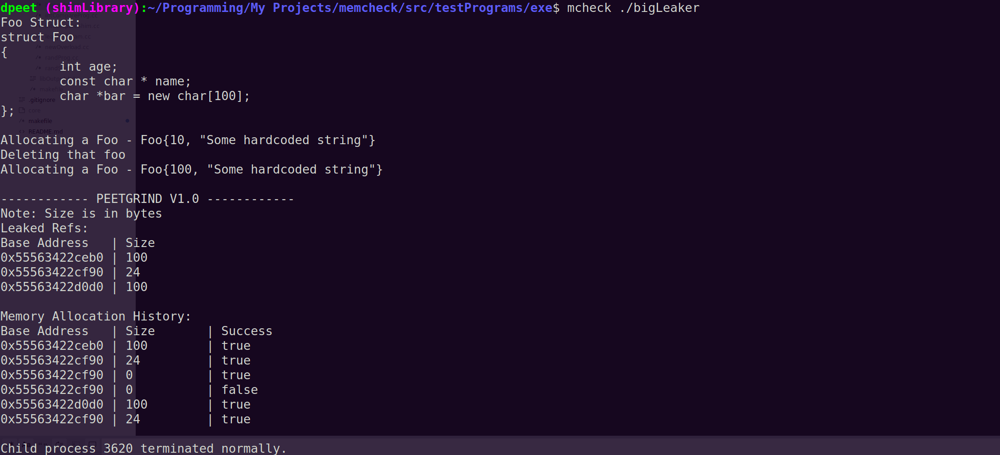

# MCheck
MCheck is a lightweight memory sanitizer similar to Valgrind. MCheck records heap memory consumption of an executable without needing to recompile by intercepting library calls to new and delete implemented in libstdc++. 

## Compatibility
1) Designed to run on Linux operating systems (tested on Ubuntu 18.0.4) using the C++17 standard
2) Untested on MacOS, but may work properly due to POSIX compliance
3) Does not support Windows, and will not run properly due to lack of POSIX compliance



## Setup
1) Clone the git repository 
```bash 
git clone git@github.com:DavidPeet8/Memory-Sanitizer.git
```
2) Change working directory to project root directory and run make 
```bash
cd <project root> && make
```
3) Run the sanitizer on an executable via `mcheck <exe to check path>`

## Details
**MCheck Flags:**
- `-v` option indicates to use verbose realtime logging

**Capabilities & Limitations:**
- Provides detailed information on the history of a processes memory consumption, including order, size, and base address of all allocations and deallocations
- Due to lightweight implementation, line numbers and code snippets cannot be provided for detected memory leaks
- Currently cannot detect leaks in C style memory management or any memory allocation system calls

## Troubleshooting
1) Check that the created shared objects `libmcheck.so` and `libmcheckstorage.so` have been installed into `~/mylibs`
2) Check that  `mcheck` has been added to your **`$PATH`** environment variable
3) If you are running mcheck in a context where DLL's must be installed at the system level (for example trying to profile with `perf`) run the following:
```bash
sudo mkdir /usr/lib/mcheck
sudo cp ~/mylibs/* .
sudo echo "/usr/lib/mcheck" >> /etc/ld.so.conf.d/.conf
sudo ldconfig  
```

## Future Improvements
- Allow for the data collector to persist the allocation timeline to a swap file if the time line begins to hog memory as this may cause memory thrashing / constant state of paging
- Allow for additional options to be passed via POSIX message queue
- Shim C style memory mangement methods (malloc, calloc, realloc, free, etc)
- Look into possible ways of tracking / overloading memory allocation system calls (mmap, brk, etc)
